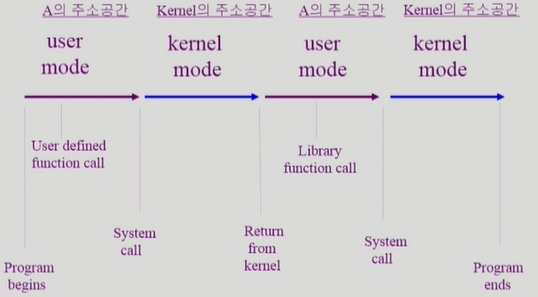

# System Structure & Program Execution

>컴퓨터 시스템에서 하드웨어의 동작, 하드웨어 위에서 프로그램의 동작

## System Structure

#### 컴퓨터 시스템 구조

- CPU

  - 메모리에서 명령어를 하나씩 읽어들여 처리
  - mode bit : OS에서 발생한 명령어인지, 사용자 프로그램에서 발생한 명령어인지 구별
  - register
    - program counter : 명령어의 메모리 주소를 가지고 있음
  - CPU는 Instruction이 하나 끝나면 Interruption이 들어왔는지 확인함

  

- Timer 

  - 특정 프로그램이 CPU를 독점하지 않도록하는 부분 (Time sharing 구현)
  - 시간이 다하면 CPU에게 interrupt 신호를 보내 CPU 제어권이 운영체제에게 넘어가도록 함
  - 타이머는 매 클럭 틱 때마다 1씩 감소
  - 타이머 값이 0이 되면 타이머 인터럽트 발생

  

- Interrupt

  - 인터럽트 당한 시점의 레지스터와 program counter를 save한 후 CPU의 제어를 인터럽트 처리 루틴에 넘김
  - Interrupt (하드웨어 인터럽트)
    - 하드웨어가 발생시킨 인터럽트
  - Trap (소프트웨어 인터럽트)
    - Exception : 프로그램이 오류를 범한 경우
    - System call : 프로그램이 커널 함수를 호출하는 경우
      - 사용자 프로그램이 운영체제의 서비스를 받기 위해 커널 함수를 호출하는 것
  - 인터럽트 벡터 
    - 해당 인터럽트의 처리 루틴 주소를 가지고 있음
  - 인터럽트 처리 루틴 (= Interrupt Service Routine, 인터럽트 핸들러)
    - 해당 인터럽트를 처리하는 커널 함수
  - 현대의 운영체제는 인터럽트에 의해 구동됨

  

- Mode bit

  - 사용자 프로그램의 잘못된 수행으로 다른 프로그램 및 운영체제에 피해가 가지 않도록 하기 위한 보호 장치 필요

  - Mode bit을 통해 하드웨어적으로 두 가지 모드의 operation 지원

    - 1 사용자 모드 : 사용자 프로그램 수행 (제한된 Instruction만 실행하도록 함)
    - 0 모니터 모드 : OS 코드 수행 (= 커널 모드, 시스템 모드) (모든 Instruction 실행 가능)
    - 보안을 해칠 수 있는 중요한 명령어는 모니터 모드에서만 수행 가능한 '특권명령'으로 규정
    - Interrupt나 Exception 발생 시 하드웨어가 mode bit을 0으로 바꿈
    - 사용자 프로그램에게 CPU를 넘기기 전에 mode bit을 1로 세팅

    

- Device Controller

  - IO device controller
    - 해당 IO 장치 유형을 관리하는 일종의 작은 CPU
    - 제어 정보를 위해 control register, status register를 가짐
    - local buffer를 가짐
  - IO는 실제 device와 local buffer 사이에서 일어남
  - Device controller는 IO가 끝났을 경우 Interrupt로 CPU에 그 사실을 알림
  - CPU는 interrupt 신호를 받아 IO 작업을 요청한 프로그램에 결과를 전달해주고 하던 일을 함

  

- DMA (Direct Memory Access)

  - 빠른 입출력 장치를 메모리에 가까운 속도로 처리하기 위해 사용
  - CPU의 중재 없이 device의 buffer storage의 내용을 메모리에 block 단위로 직접 전송
  - 바이트 단위가 아니라 block 단위로 인터럽트를 발생시킴
  - IO device에서 처리한 정보를 메모리에 저장하고 그 사실을 CPU에게 알림
  - CPU에 전달되는 Interrupt 횟수를 줄여줌

  

- IO의 수행

  - 모든 입출력 명령은 특권 명령
  - 사용자 프로그램이 IO를 수행하는 과정
    - 시스템콜 (System call)
      - 사용자 프로그램이 운영체제에게 IO 요청
      - 프로그램이 운영체제에게 요청하기 위해서 직접 Interrupt 신호(**Trap**)를 보낼 수 있음
      - Interrupt를 받아들인 CPU는 modebit을 0으로 바꾸고 OS에게 CPU 제어권이 넘어가 OS가 IO 신호를 각각의 device controller에 전달
    - trap을 사용하여 인터럽트 벡터의 특정 위치로 이동
    - 제어권이 인터럽트 벡터가 가리키는 인터럽트 서비스 루틴으로 이동
    - 올바른 IO 요청인지 확인 후 IO 수행
    - IO 완료 시 제어권을 시스템콜 다음 명령으로 옮김 (**하드웨어 인터럽트** 발생)

#### 동기식 입출력과 비동기식 입출력

- 동기식 입출력 (Synchronous I/O)
  - IO 요청 후 입출력 작업이 완료된 후에야 제어가 사용자 프로그램에 넘어감
  - 구현 방법 1
    - IO가 끝날 때까지 CPU를 낭비시킴
    - 매 시점 하나의 IO만 일어날 수 있음
  - 구현 방법 2
    - IO가 완료될 때까지 해당 프로그램에게서 CPU를 빼앗음
    - IO 처리를 기다리는 줄에 그 프로그램을 줄 세움
    - 다른 프로그램에게 CPU를 줌
- 비동기식 입출력 (Asynchronous IO)
  - IO가 시작된 후 입출력 작업이 끝나기를 기다리지 않고 제어가 사용자 프로그램에 즉시 넘어감
- 두 경우 모두 IO의 완료는 Interrupt로 알려줌

#### 서로 다른 입출력 명령어

- IO를 수행하는 special instruction에 의해 (좌측, 일반적)
  - 메모리 접근 Instruction, IO 수행 Instruction이 따로 존재
- Memory Mapped IO에 의해 (우측)
  - 메모리 주소에 연장 주소를 붙여 IO 주소에 해당하는 메모리 접근 Instruction에 대해서는 IO 수행

#### 저장장치 계층 구조

- Register (CPU 내부)
- Cache Memory (SRAM)
- Main Memory (DRAM)
- Primary는 byte 단위로 접근이 가능하기 때문에 CPU가 메모리에서 직접 명령어를 읽어 수행할 수 있음 (Executable)
- Secondary는 sector 단위로 접근하기 때문에 CPU가 직접 접근해 명령어를 수행할 수 없음
- Caching : 정보를 빠른 매체로 가져다 놓는 것. 재사용을 목표로 함

##  Program Execution

#### 메모리 Load

- 프로그램은 실행파일 형태로 File system에 저장되어 있음
- 실행파일을 실행시키면 Virtual memory를 거쳐 Physical memory에 올라가 프로세스가 됨
- 실행 시키면 각각의 프로세스만의  독자적인 Address space가 만들어짐
- Address space는 code, data, stack으로 나누어짐
- Virtual memory에 올라간 모든 프로세스 정보가 Physical memory에 올라가는 것은 아님
- 실행되고 있는 프로세스 중 필요한 정보들만  Physical memory에 올라가고 그렇지 않은 정보는 Swap area에 버림(저장함)
- File system과 Swap area는 서로 용도가 다름
- Virtual memory 주소를 Physical memory 주소로 변환하는 하드웨어 장치가 존재

#### 커널 주소 공간의 내용

- Code
  - 자원을 효율적으로 관리하기 위한 코드
  - 사용자에게 편리한 인터페이스를 제공하기 위한 코드
  - 각각의 시스템콜, 인터럽트를 어떻게 처리할지에 대한 코드
- Data
  - 각 하드웨어를 관리하기 위한 자료구조를 저장
  - PCB (Process Control Block)
    - 시스템 안에서 실행되는 프로그램들을 관리하기 위한 자료구조를 저장
    - 각각의 프로세스마다 만들어짐

- Stack
  - 운영체제도 함수 구조로 코드가 짜여져 있기 때문에 함수를 호출할 때 stack 구조를 사용함
  - 각각의 프로세스마다 커널 스택을 따로 사용함

#### 사용자 프로그램이 사용하는 함수

- 함수
  - 사용자 정의 함수
    - 자신의 프로그램에서 정의한 함수
  - 라이브러리 함수
    - 자신의 프로그램에서 정의하지 않고 갖다 쓴 함수
    - 자신의 프로그램의 실행 파일에 포함되어 있다
  - 커널 함수
    - 운영체제 프로그램의 함수
    - 커널 함수의 호출 = 시스템 콜

#### 프로그램의 실행

- user mode에서 실행되다가 시스템 콜이 발생하면 kernel mode로 옮겨감
- kernel mode에서 실행이 끝나면 다시 user mode로 넘어감