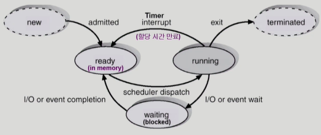
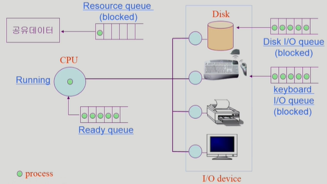
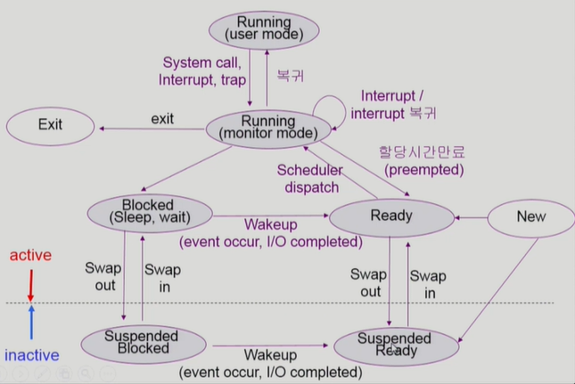
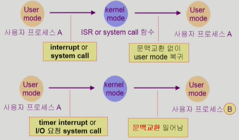
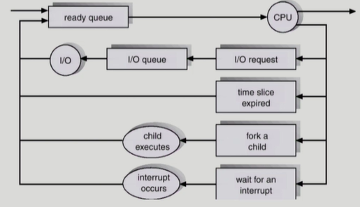
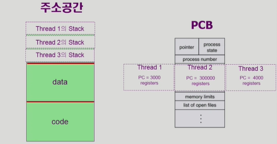
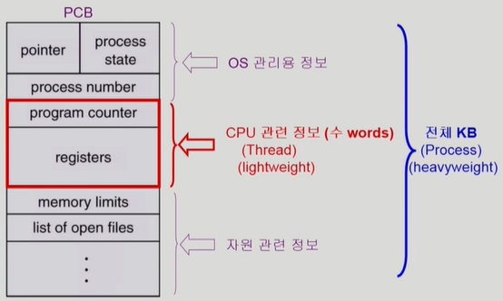

# Process

> "Process is a program in execution"
>
> 프로세스 개념, 프로세스 상태, Process Control Block (PCB), 문맥교환(Context Switch), 프로세스를 스케쥴링하기 위한 큐, 스케줄러(Scheduler), Thread

## Process

#### 문맥 (Context)

- 프로세스의 현재 상태를 나타내는데 필요한 모든 요소
  - 시분할, 멀티태스킹을 하는데 있어서 프로세서의 현재 문맥을 알고있어야 함
- CPU 수행 상태를 나타내는 하드웨어 문맥
  - Program Counter
  - 각종 register
- 프로세스의 주소 공간
  - code, data, stack
- 프로세스 관련 커널 자료 구조
  - PCB(Process Control Block)
  - Kernel stack
    - 프로세스가 시스템콜을 하게되면 PC가 커널의 코드를 실행
    - 커널에서 함수 호출이 일어나면 커널 스택에 쌓임
    - 시스템콜을 요청한 프로세스마다 별도의 커널 스택을 두고 있음

#### 상태 (Process State)

- Running
  - CPU 를 잡고 Instruction을 수행중인 상태
- Ready
  - CPU를 기다리는 상태 (메모리 등 다른 조건을 모두 만족하고)
- Blocked (wait, sleep)
  - CPU를 주어도 당장 instruction을 수행할 수 없는 상태
  - Process 자신이 요청한 event가 즉시 만족되지 않아 이를 기다리는 상태
  - ex) 디스크에서 file을 읽어와야 하는 경우
- Suspended (stopped)
  - mid-term scheduler가 도입되면서 생겨난 상태
  - 외부적인 이유로 프로세스의 수행이 정지된 상태
  - 프로세스는 통째로 디스크에 swap out 된다
  - ex) 사용자가 프로그램을 일시 정지시킨 경우, 시스템이 여러 이유로 프로세스를 잠시 중단시킨 경우
- Blocked: 자신이 요청한 event가 만족되면 Ready
- Suspended: 외부에서 resume 해주어야 Active

-----

- New 
  - 프로세서가 생성중인 상태
- Terminated
  - 수행(execution)이 끝난 상태 

#### Process Control Block (PCB)

- 운영체제가 각 프로세스를 관리하기 위해 프로세스 당 유지하는 정보
- 구성 요소 (구조체로 유지)
  - OS가 관리상 사용하는 정보
    - Process state, Process ID
    - scheduling information, priority
  - CPU 수행 관련 하드웨어 값
    - Program Counter, registers
  - 메모리 관련
    - code, data, stack의 위치 정보
  - 파일 관련
    - Open file descriptors

#### 문맥 교환 (Context Switch)

- CPU를 한 사용자 프로세스에서 다른 사용자 프로세스로 넘겨주는 과정 
- CPU가 다른 프로세스에게 넘어갈 때 운영체제는 다음을 수행
  - CPU를 내어주는 프로세스의 상태를 그 프로세스의 PCB에 저장
  - CPU를 새롭게 얻는 프로세스의 상태를 PCB에서 읽어옴

- 시스템콜이나 인터럽트 발생 시 반드시 context switch가 일어나는 것은 아님\

  - user mode 에서 kernel mode로 넘어가는 과정은 프로세스가 바뀌는 과정에 비해 오버헤드가 적음

  

#### 프로세스 스케줄링

##### 사용되는 큐

- Job queue
  - 현재 시스템 내에 있는 모든 프로세스의 집합
- Ready queue
  - 현재 메모리 내에 있으면서 CPU를 잡아서 실행되기를 기다리는 프로세스의 집합
- Device queues
  - I/O device의 처리를 기다리는 프로세스의 집합

- 프로세스들은 각 큐를 오가며 수행됨

##### 스케줄링 

#### 스케줄러 (Scheduler)

- Long-term scheduler (Job scheduler)
  - 시작 프로세스 중 어떤 것들을 ready queue로 보낼지 결정
  - 프로세스에 memory 및 각종 자원을 주는 문제
  - degree of Multiprogramming을 제어
    - 메모리에 올라가있는 프로세스의 수
  - time sharing system에는 보통 장기 스케줄러가 없음 (무조건 ready)
- Short-term scheduler (CPU scheduler)
  - 어떤 프로세스를 다음번에 running 시킬지 결정
  - 프로세스에 CPU를 주는 문제
  - 충분히 빨라야 함 (ms 단위)

- Medium-term scheduler (Swapper)
  - 여유 공간 마련을 위해 프로세스를 통째로 메모리에서 디스크로 쫒아냄
  - 프로세스에게서 memory를 뺏는 문제
  - degree of Multiprogramming을 제어

## Thread

#### 개념

- "A thread (or <u>lightweight</u> process) is a basic unit of CPU utilization"
- 프로세스 하나에 CPU 수행 단위를 여러개 두는 것

#### 구성

- program counter
- register set
- stack space

#### Task (thread간에 공유하는 부분)

- code section
- data section
- OS resources

#### 장점

- Responsiveness 응답성
  - 하나의 서버 스레드가 blocked(waiting) 상태인 동안에도 동일한 태스크 내의 다른 스레드가 실행되어 빠른 처리를 할 수 있다.
- Resource Sharing 자원공유
  - 동일한 일을 수행하는 다중 스레드가 협력하여 높은 처리율(throughput)과 성능 향상을 얻을 수 있다.
- Economy 경제성
  - 또 다른 프로세스를 생성하고 CPU switching 하는것보다 Thread를 생성하고 스위칭 하는게 오버헤드가 적음
- Utilization of MP Architectures
  - CPU가 여러개 있는 아키텍처(Multiprocessor)에서 병렬적으로 처리할 수 있음

#### Implementation of threads

- Kernel Threads
  - thread가 여러개 있다는 사실을 OS 커널이 알고 있음
  - 커널에 의해 지원됨
- User Threads
  - thread가 여러개 있다는 사실을 OS는 모르고 있고, 유저 프로그램이 thread를 관리
  - kernel thread보다는 조금 제한적일 수 있음

