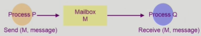

# Process Management

>프로세스 관리
>
>프로세스 생성, 종료, 프로세스 관련 시스템콜, 프로세스 간 협력


## 프로세스 생성 및 종료

#### 생성 (Creation)

- 부모 프로세스가 자식 프로세스 생성
  - 복제 생성
  - 문맥을 복사함 (Address space, PC를 그대로 복사)
  - Copy-on-write (COW)
    - 자식이 생성되었을땐 부모의 내용을 그대로 공유하고 있음 (PC가 같은 주소를 가리킴)
    - 자식 프로세스에 write가 발생했을 때 address space(code, data, stack)를 복사
- 프로세스의 트리 형성

- 프로세스는 자원을 필요로 함
  - 운영체제로부터 받는다
  - 부모와 공유한다
- 자원의 공유
  - 부모와 자식이 모든 자원을 공유하는 모델
  - 일부를 공유하는 모델
  - (<u>일반적</u>) 전혀 공유하지 않는 모델. 서로 경쟁하는 체계

- 수행 (execution)
  - 부모와 자식은 공존하며 수행되는 모델
  - 자식이 종료(terminate)될 때까지 부모가 기다리는(wait) 모델

- 주소 공간 (Address space)
  - 자식은 부모의 공간을 복사함 (binary and OS data)
  - 자식은 그 공간에 새로운 프로그램을 올림
- 유닉스의 예
  - <u>fork()</u> 시스템콜이 새로운 프로세스를 생성
    - 부모를 그대로 복사 (OS data except PID + binary)
    - 주소 공간 할당
  - fork 다음에 이어지는 <u>exec()</u> 시스템콜을 통해 새로운 프로그램을 메모리에 올림


#### 종료 (Termination)

- 부모 프로세스를 종료하려면 자식 프로세스가 먼저 종료되어야 함

- 프로세스가 마지막 명령을 수행한 후 운영체제에게 이를 알려줌 (<u>exit</u>, 자발적)
  - 자식이 부모에게 output data를 보냄 (via <u>wait</u>)
  - 프로세스의 각종 자원들이 운영체제에게 반납됨
- 부모 프로세스가 자식의 수행을 종료시킴 (<u>abort</u>, 강제적)
  - 자식이 할당 자원의 한계치를 넘어섬
  - 자식에게 할당된 태스크가 더 이상 필요하지 않음
  - 부모가 종료(exit)하는 경우
    - 운영체제는 부모 프로세스가 종료하는 경우 자식이 더 이상 수행되도록 두지 않는다.
    - 단계적인 종료


## 프로세스 관련 시스템콜

#### fork()

- A process is created by the fork() system call
  - creates a new address space that is a duplicate of the caller

```C
int main() {
    int pid;
    pid = fork(); // 자식 프로세스는 이 지점부터 실행됨
    if (pid == 0) /* 자식 */
        printf("\n Hello, I am child\n");
    else if (pid > 0) /* 부모 */
        printf("\n Hello, I am parent\n");
}
```


#### exec()

- A process can execute a different program by the exec() system call
  - replaces the memory image of the caller with a new program

```C
int main() {
    int pid;
    pid = fork();
    if (pid == 0) { /* 자식 */
        printf("\n Hello, I am child! Now I'll run date \n");
        execlp("/bin/date", "/bin/date", (char*)0);
    } else if (pid > 0) /* 부모 */
        print("\n Hello, I am parent!\n");
}
```


#### wait()

- sleep until child is done

- 프로세스 A가 wait() 시스템 콜을 호출하면
  - 커널은 child가 종료될 때가지 프로세스 A를 sleep 시킨다. (block 상태)
  - child process가 종료되면 커널은 프로세스 A를 깨운다. (ready 상태)

```C
int main() {
    int childPID;
    childPID = fork();
    if (childPID == 0) {
        <code for child process>
    } else {
        ...
        wait();
    }
}
```


#### exit()

- free all the resources, notify parent
- 프로세스 종료
  - 자발적 종료
    - 마지막 statement 수행 후 exit() 시스템 콜을 통해
    - 프로그램에 명시적으로 적어주지 않아도 main 함수가 리턴되는 위치에 컴파일러가 넣어줌
  - 비자발적 종료
    - 부모 프로세스가 자식 프로세스를 강제 종료시킴
      - 자식 프로세스가 한계치를 넘어서는 자원 요청
      - 자식에게 할당된 태스크가 더 이상 필요하지 않음
    - 키보드로 kill, break 등을 친 경우
    - 부모가 종료하는 경우
      - 부모 프로세스가 종료하기 전에 자식들이 먼저 종료됨


## 프로세스 간 협력

- 독립적 프로세스 (Independent process)

  - 프로세스는 각자의 주소 공간을 가지고 수행되므로 원칙적으로 하나의 프로세스는 다른 프로세스의 수행에 영향을 미치지 못함

  

- 협력 프로세스 (Cooperating process)

  - 프로세스 협력 메커니즘을 통해 하나의 프로세스가 다른 프로세스의 수행에 영향을 미칠 수 있음

  

- 프로세스 간 협력 메커니즘 (IPC: Interprocess Communication)

  - message passing
    - 커널을 통해 메시지 전달
  - shared memory
    - 서로 다른 프로세스 간에도 일부 주소 공간을 공유하게 하는 shared memory 메커니즘이 있음


- Thread: thread는 사실상 하나의 프로세스이므로 프로세스 간 협력으로 보기는 어렵지만 동일한 process를 구성하는 thread 간에는 주소 공간을 공유하므로 협력이 가능


#### Message passing

- Message system

  - 프로세스 사이에 공유 변수(shared variable)를 일체 사용하지 않고 통신하는 시스템
  - 커널을 통해서 전달

- Direct communication

  - 통신하려는 프로세스의 이름을 명시적으로 표시

  

  

- Indirect communication

  - mailbox (또는 port)를 통해 메시지를 간접 전달

  