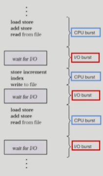
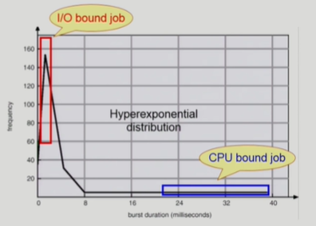
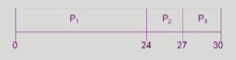
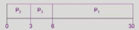
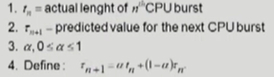
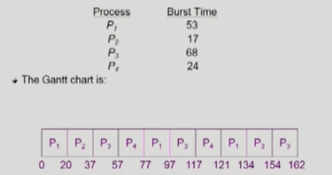
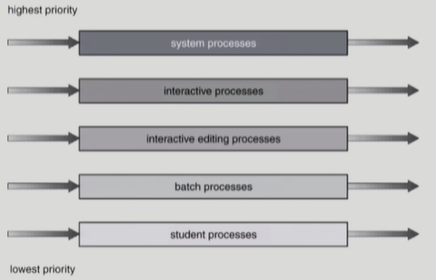
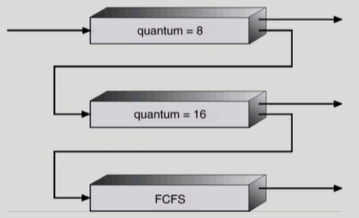

# CPU Scheduling

>CPU and I/O Bursts in Program Execution, CPU burst time의 분포, 프로세스의 특성 분류, CPU Scheduler and Dispatcher, 스케줄링 기준, 스케줄링 알고리즘

#### CPU and I/O Bursts in Program Execution

#### CPU-burst Time의 분포

- 여러 종류의 job(=process)이 섞여 있기 때문에 CPU 스케줄링이 필요하다
  - Interactive job에게 적절한 response 제공 요망
  - CPU와 I/O 장치 등 시스템 자원을 골고루 효율적으로 사용 

#### 프로세스의 특성 분류

- I/O-bound process
  - CPU를 잡고 계산하는 시간보다 I/O에 많은 시간이 필요한 job
  - many short CPU bursts
- CPU-bound process
  - 계산 위주의 job
  - few very long CPU bursts

#### CPU Scheduler & Dispatcher

- CPU Scheduler
  - Ready 상태의 프로세스 중에서 이번에 CPU를 줄 프로세스를 고른다
  - 운영체제 안에 CPU를 스케줄링하는 코드를 말함
- Dispatcher
  - CPU의 제어권을  CPU 스케줄러에 의해 선택된 프로세스에게 넘긴다
  - 이 과정을 context switch라고 한다.
  - 운영체제 안에 포함되어 있음

- CPU 스케줄링이 필요한 경우는 프로세스에게 다음과 같은 상태 변화가 있는 경우

  1. Running --> Blocked (ex. I/O 요청하는 시스템 콜)
  2. Running --> Ready (ex. 할당시간만료로 timer interrupt)
  3. Blocked --> Ready (ex. I/O 완료 후 인터럽트)
  4. Terminate

  ✔ 1, 4에서의 스케줄링은 **non-preemptive (비선점형 스케줄링, 자진 반납)**

  ✔ 다른 스케줄링은 **preemptive (선점형 스케줄링, 강제로 빼앗음)**

#### Scheduling Criteria 

> Performance Index (= Performance Measure, 성능 척도)

- CPU utilization (이용률)
  - keep the CPU as busy as possible
- Throughput (처리량)
  - num of processes that complete their execution per time unit
- Turnaround time (소요시간, 반환시간)
  - amount of time to execute a particular process
  - CPU 처리를 기다리는것 부터 I/O까지 하고 나갈때까지 소요된 시간
- Waiting time (대기 시간)
  - amount of time a process has been waiting in the ready queue
  - CPU 처리를 기다리는 시간
- Response time (응답 시간)
  - amount of time it takes from when a request was submitted until the first response is produced. not output
  - 처음 CPU 대기열에 들어와 처리를 기다리는 시간

## Scheduling Algorithms

#### FCFS (First-Come First-Served)

- 프로세스의 도착 순서대로 스케줄. 순서에 따라 평균적으로 기다리는 시간이 크게 달라질 수 있음
- <u>Convoy effect</u> : short process behind long process
- non-preemptive 

#### SJF (Shortest-Job-First)

- CPU burst time이 가장 짧은 프로세스를 제일 먼저 스케줄
- 각 프로세스의 다음번 CPU burst time을 가지고 스케줄링에 활용
- Two schemes
  - Nonpreemptive
    - 일단 CPU를 잡으면 이번 CPU burst가 완료될 때 까지 CPU를 선점 당하지 않음
  - Preemptive
    - 현재 수행중인 프로세스와 남은 burst time보다 더 짧은 CPU burst time을 가지는 새로운 프로세스가 도착하면 CPU를 빼앗짐
    - Shortest-Remaining-Time-First (SRTF)라고도 부름
- 단점
  - Starvation 현상이 일어날 수 있음
  - 프로세스 당 CPU 사용 시간을 미리 알 수 없음

#### 다음 CPU Burst Time의 예측

- 다음 CPU burst time은 추정(estimate)만이 가능하다.
- 과거의 CPU burst time을 이용해서 추정

#### Priority Scheduling

- highest priority를 가진 프로세스에게 CPU 할당 (smallest integer - highest priority)
  - Preemptive
  - Nonpreemptive

- SJF는 일종의 priority scheduling이다.
- 문제
  - Starvation : priority가 낮은 프로세스는 영원히 실행되지 않을 수 있음
- 해결
  - Aging : 시간이 지날수록 프로세스의 priority가 올라감

#### Round Robin (RR)

- 각 프로세스는 동일한 크기의 할당 시간(time quantum)을 가짐 (일반적으로 10-100 ms)
- 할당 시간이 지나면 프로세스는 선점당하고 ready queue의 제일 뒤에 가서 다시 줄을 선다
- n개의 프로세스가 ready queue에 있고 할당 시간이 q time unit인 경우 각 프로세스는 최대 q time unit 단위로 CPU시간의 1/n을 얻는다.
  - 어떤 프로세스도 (n-1)q time unit 이상 기다리지 않는다.
- Performance
  - <u>Response time이 작다</u>
  - q large --> FCFS
  - q small --> context switch 오버헤드가 커진다

- Example

#### Multilevel Queue

- Ready queue를 여러 개로 분할
  - foreground (interactive)
  - background (batch - no human interaction)
- 각 큐는 독립적인 스케줄링 알고리즘을 가짐
  - foreground - RR
  - background - FCFS
- 큐에 대한 스케줄링이 필요
  - Fixed priority scheduling
    - serve <u>all from foreground</u> <u>then from background</u>
    - possibility of <u>starvation</u>
  - Time slice
    - 각 큐에 CPU time을 적절한 비율로 할당
    - ex. 80% to foreground in RR, 20% to background

#### Multilevel Feedback Queue

- 프로세스가 다른 큐로 이동 가능
- 위의 큐가 비었을 때 아래 큐의 프로세스를 실행
- 예측이 필요없고, burst time이 짧은 프로세스들이 유리한 구조
- Aging을 이와 같은 방식으로 구현할 수 있음
- Multilevel-feedback-queue scheduler를 정의하는 파라미터들
  - Queue의 수
  - 각 큐의 scheduling algorithm
  - Process를 상위 큐로 보내는 기준
  - Process를 하위 큐로 내쫒는 기준
  - 프로세스가 CPU 서비스를 받으려 할 때 들어갈 큐를 결정하는 기준

#### Example of Multilevel Feedback Queue

- Three queues
  - Q0 - time quantum 8 ms
  - Q1- time quantum 16 ms
  - Q2 - FCFS
- Scheduling
  - new job이 queue Q0로 들어감
  - CPU를 잡아서 할당 시간 8ms 동안 수행
  - 8ms 동안 다 끝내지 못했으면 queue Q1으로 내려감
  - Q1에 줄서서 기다렸다가 CPU를 잡아서 16ms 동안 수행됨
  - 16ms 에 끝내지 못한 경우 queue Q2로 쫓겨남

#### Multiple-Processor Scheduling

- CPU가 여러 개인 경우 스케줄링은 더욱 복잡해짐
- Homogeneous processor인 경우
  - Queue에 한 줄로 세워서 각 프로세서가 알아서 꺼내가게 할 수 있다
  - 반드시 특정 프로세서에서 수행되어야 하는 프로세스가 있는 경우에는 문제가 더 복잡해짐
- Load sharing
  - 일부 프로세서에 job이 몰리지 않도록 부하를 적절히 공유하는 메커니즘 필요
  - 별개의 큐를 두는 방법 vs 공동 큐를 사용하는 방법
- Symmetric Multiprocessing (SMP)
  - 각 프로세서가 각자 알아서 스케줄링 결정 
- Asymmetric multiprocessing
  - 하나의 프로세서가 시스템 데이터의 접근과 공유를 책임지고 나머지 프로세서는 거기에 따름

#### Real-Time Scheduling

- Hard real-time systems
  - Hard real-time task는 정해진 시간 안에 반드시 끝내도록 스케줄링 해야 함
- Soft real-time computing
  - Soft real-time task는 일반 프로세스에 비해 높은 priority를 갖도록 해야 함

#### Thread Scheduling

- Local Scheduling
  - User level thread의 경우 사용자 수준의 thread library에 의해 어떤 thread를 스케줄할지 결정
- Global Scheduling
  - Kernel level thread의 경우 일반 프로세스와 마찬가지로 커널의 단기 스케줄러가 어떤 thread를 스케줄할지 결정

#### Algorithm Evaluation

- Queueing models
  - 확률 분포로 주어지는 arrival rate와 service rate 등을 통해 각종 performance index 값을 계산
- Implementation & Measurement
  - 실제 시스템에 알고리즘을 구현하여 실제 작업에 대해서 성능을 측정 비교
- Simulation
  - 알고리즘을 모의 프로그램으로 작성 후 trace를 입력으로 하여 결과 비교

