# Process Synchronization

> Concurrency Control(병행 제어)이라고도 불림
>
> 데이터의 접근, Race condition, OS에서 Race condition이 발생하는 경우, The Critical-Section Problem, 프로그램적 해결법의 충족 조건, 해결 알고리즘 3가지, Semaphore, Deadlock and Starvation, Classical Problems of Synchronization (Bounded-Buffer Problem, Readers-Writers Problem, Dining-Philosophers Problem), Monitor


## Process Synchronization Problem

#### 데이터의 접근

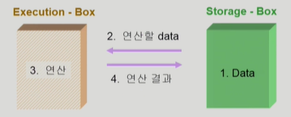

- CPU - Memory


#### Race Condition

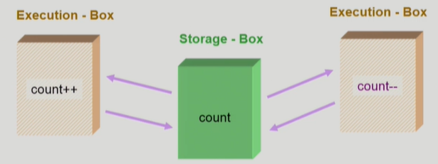

- 여러 주체가 하나의 데이터를 동시에 접근하려고 할 때 Race condition이 발생
- S-box를 공유하는 E-box가 여럿 있는 경우 Race condition의 가능성이 있음

:heavy_check_mark: 커널 내부 데이터를 접근하는 루틴들 간 Race가 발생하게 되면 문제가 됨


### OS에서 Race conditon이 발생하는 경우

#### 1. Kernel 수행 중 인터럽트 발생 시

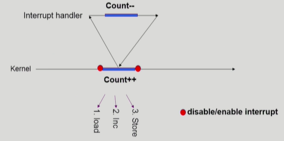

- 커널모드 running 중 interrupt가 발생하여 인터럽트 처리루틴이 수행
  - 양쪽 다 커널 코드이므로 kernel address space 공유
- 해결책 : 인터럽트를 disable


#### 2. Process가  시스템 콜을 하여 kernel mode로 수행 중인데 context switch가 일어나는 경우

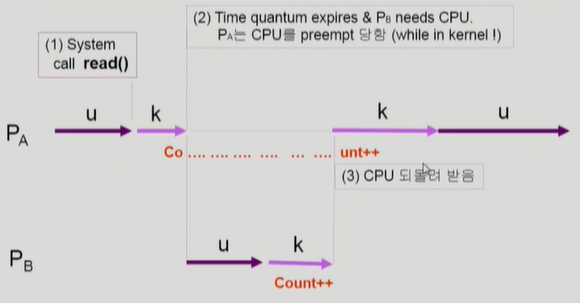

- A가 커널모드로 수행 중일 때 타이머가 작동하여 CPU가 B에게 가는 경우
- 해결책 : 커널 모드에서 수행 중일 때는 CPU를 선점하지 않음
  - 커널 모드에서 사용자 모드로 돌아갈 때 선점


#### 3. Multiprocessor에서 shared memory 내의 kernel data

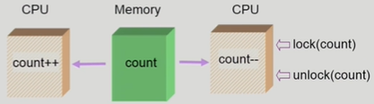

- CPU가 여러개 있는 경우 1, 2번의 해결책은 도움이 되지 않음 
- 해결책 1 : 한 번에 하나의 CPU만이 커널에 들어갈 수 있게 하는 방법
- 해결책 2 : 커널 내부에 있는 각 공유 데이터에 접근할 때마다 그 데이터에 대한 lock/unlock을 거는 방법


#### Process Synchronization 문제

- 공유 데이터의 동시 접근(concurrent access)은 데이터의 불일치 문제를 발생시킬 수 있다.
- 일관성 유지를 위해서는 협력 프로세스간의 실행 순서를 정해주는 메커니즘 필요
- Race condition
  - 여러 프로세스들이 동시에 공유 데이터를 접근하는 상황
  - 데이터의 최종 연산 결과는 마지막에 그 데이터를 다룬 프로세스에 따라 달라짐


## The Critical-Section Problem

#### The Critical-Section Problem

- n개의 프로세스가 공유 데이터를 동시에 사용하기를 원하는 경우
- 각 프로세스의 code segment에는 공유 데이터를 접근하는 코드인  critical section이 존재
- Problem
  - 하나의 프로세스가 critical section에 있을 때 다른 모든 프로세스는 critical section에 들어갈 수 없어야 한다.


#### Initial Attempts to Solve Problem

- 두 개의 프로세스가 있다고 가정 P0, P1

- 프로세스들의 일반적인 구조

  ```
  do {
  	entry section
  	critical section
  	exit section
  	remainder section
  } while (1);
  ```

- 프로세스들은 수행의 동기화를 위해 몇몇 변수를 공유할 수 있다 (**Synchronization variable**)


#### 프로그램적 해결법의 충족 조건

- **Mutual Exclusion**
  - 프로세스 Pi가 critical section 부분을 수행 중이면 다른 모든 프로세스들은 그들의 critical section에 들어가면 안된다.
- **Progress**
  - 아무도 critical section에 있지 않은 상태에서 critical section에 들어가고자 하는 프로세스가 있으면 critical section에 들어가게 해주어야 한다
- **Bounded Waiting**
  - 프로세스가 critical section에 들어가려고 요청한 후부터 그 요청이 허용될 때까지 다른 프로세스들이 critical section에 들어가는 횟수에 한계가 있어야 한다. (**starvation**이 생기지 않아야 한다.)
- 가정
  - 모든 프로세스의 수행 속도는 0보다 크다
  - 프로세스들 간의 상대적인 수행 속도는 가정하지 않는다


#### Algorithm 1

- P(i)는 turn == i 일 때 critical section에 들어갈 수 있음
- 상대방이 critical section에 들어갔다가 차례를 넘겨주어야 내 차례가 오게됨
- Progress 조건을 잘 만족하지 못함

- ```
  Synchronization variable:
  	int turn; // 처음에는 0
  
  Process P(0):
  do {
  	while (turn != 0); // 나의 차례
  	critical section
  	turn = 1;         // 상대방 차례
  	remainder section
  } while (1);
  ```


#### Algorithm 2

- P(i)는 turn == i 일 때 critical section에 들어갈 수 있음 
- flag는 critical section에 들어갔다가 나올때 내리는데 flag를 세우고 기다리는 도중 상대방에게 CPU가 넘어가게 되면 아무도 critical section에 들어가지 못하는 문제가 발생할 수 있음 

- ```
  Synchronization variable:
  	boolean flag[2]; // 초기값은 false
  
  Process P(i):
  do {
  	flag[i] = true;   // flag을 세움
  	while (flag[j]);  // 상대방이 flag를 세웠는지 확인하고 내릴때까지 기다림
  	critical section
  	flag[i] = false;  // flag를 내림
  	remainter section
  } while (1);
  ```

  

#### Algorithm 3 (Peterson's Algorithm)

- Combined synchronization variables of algorithms 1 and 2

- 세 가지 조건을 모두 충족하는 알고리즘

- Busy Waiting(= spin lock) : 계속 CPU와 memory를 쓰면서 wait

  ```
  Combined synchronization variables of algorithms 1 and 2
  
  Process P(i):
  do {
  	flag[i] = true;   // flag를 세움
  	turn = j;         // 상대방에게 턴을 넘겨줌
  	while (flag[j] && turn == j); // 두가지 조건을 모두 만족해야만 상대방을 기다려줌
  	critical section
  	flag[i] = false;
  	remainder section
  } while (1);
  ```

  

#### Synchronization Hardware

- 하드웨어적으로 Test & Modify를 <u>atomic</u>하게 수행할 수 있도록 지원하는 경우 앞의 문제는 간단히 해결

  - a를 읽어내고 a에 1을 저장하는 과정을 하나의 Instruction으로(atomic하게) 수행할 수 있도록 함

  

  - Mutual Exclusion with Test & Set

    ```
    Synchronization variable:
    	boolean lock = false;
    
    Process P(i):
    do {
    	while (Test_and_Set(lock));
    	critical section
    	lock = false;
    	remainder section
    }
    ```


#### Semaphores

- 앞의 방식들을 추상화시킴

- Semaphore S

  - Integer variable
  - 아래의 두 가지 atomic 연산에 의해서만 접근 가능
  
  - `P` : 공유 데이터를 획득하는 과정 (lock)
  
    ```
    P(S): 
    	while (S<=0) do no-op; // busy-wait
    	S--; // 자원이 있으면 가져감
    ```

  - `Q` : 공유 데이터를 반납하는 과정 (unlock)
  
    ```
    V(S):
    	S++; // 자원을 반납
    ```
    
    

#### Critical Section of n Processes

- Busy-Wait 은 효율적이지 못함 (=spin lock)
- Block & Wakeup 방식의 구현 (=sleep lock)

```
Synchronization variable:
	semaphore mutex; // initially 1 : 1개가 들어갈 수 있다.
	
Process P(i):
do {
	P(mutex);
	critical section
	V(mutex);
	remainder section
} while (1);
```


#### Block / Wakeup Implementation

- block과 wakeup을 다음과 같이 가정
  - **block**
    - 커널은 block을 호출한 프로세스를 suspend 시킴
    - 이 프로세스의 PCB를  semaphore에 대한 wait queue에 넣음
  - **wakeup(P)**
    - block된 프로세스 P를 wakeup 시킴
    - 이 프로세스의 PCB를 ready queue로 옮김

- Semaphore 연산의 구현

  ```
  typedef struct {
  	int value;			// semaphore
  	struct process *L;	// process wait queue
  } semaphore;
  ```

  ```
  P(S):
  	S.value--;			// 들어갈 준비
  	if (S.value < 0) {	// 음수면 들어갈 수 없음 (가져갈 자원이 없음)
  		add this process to S.L;
  		block();
  	}
  ```

  ```
  V(S):
  	S.value++;
  	if (S.value <= 0) {	// 깨워야 할 semaphore가 있는 경우
  		remove a process P from S.L
  		wakeup(P);
  	}
  ```

  

#### Busy-Wait vs Block/Wakeup

- Critical section의 길이가 긴 경우 Block/Wakeup이 적당
- Critical section의 길이가 매우 짧은 경우 Block/Wakeup의 오버헤드가 더 Busy-Wait보다 커질 수 있음
- 일반적으로는 Block/Wakeup 방식이 더 좋음


#### Two Types of Semaphores

- Counting semaphore
  - 도메인이 0 이상인 임의의 정수값
  - 주로 resource counting에 사용
- Binary semaphore (=mutex)
  - 0 또는 1값만 가질 수 있는 semaphore
  - 주로 mutual exclusion (lock/unlock)에 사용


#### Deadlock and Starvation

- Deadlock

  - 둘 이상의 프로세스가 서로 상대방에 의해 충족될 수 있는 event를 무한히 기다리는 현상

  - S와 Q가 1로 초기화 된 semaphore라고 하면 S와 Q를 모두 차지할때까지 놓아주지 않음

  - 영원히 놓아주지 않다가 처음 V가 나올때 release함

    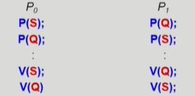

- Starvation
  - infinite blocking
    - 프로세스가 suspend된 이유에 해당하는 semaphore 큐에서 빠져나갈 수 없는 현상


## Classical Problems of Synchronization

#### Bounded-Buffer Problem (Producer-Consumer Problem)

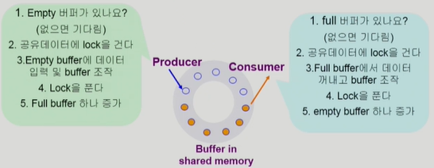

- Shared data
  - buffer 자체 및 buffer 조작 변수
- Synchronization variables
  - semaphore full = 0, empty= n; 
    - 들어있는 버퍼, 비어있는 버퍼를 세기 위한 변수
  - semaphore mutex = 1; 
    - lock을 걸기 위한 변수

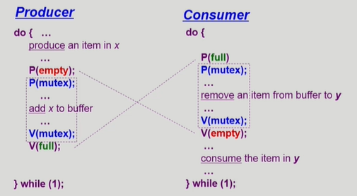


#### Readers-Writers Problem

- 한 프로세스가 DB에 write 중일 때 다른 프로세스가 접근하면 안됨
- read는 동시에 여럿이 해도 됨
- Solution
  - Writer가 DB에 접근 허가를 아직 얻지 못한 상태에서는 모든 대기중인 Reader들을 다 DB에 접근하게 해준다
  - Writer는 대기중인 Reader가 하나도 없을 때 DB 접근이 허용된다
  - 일단 Writer가 DB에 접근 중이면 Reader들은 접근이 금지된다
  - Writer가 DB에서 빠져나가야만 Reader의 접근이 허용된다
- Shared data
  - DB 자체
  - readcount : 현재 DB에 접근중인 Reader의 수 
- Synchronization variables
  - mutex : 공유 변수 readcount를 접근하는 코드의 mutual exclusion 보장을 위해 사용
  - db : reader와 writer가 공유 DB 자체를 올바르게 접근하게 하는 역할

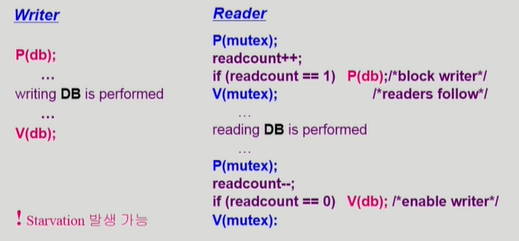


#### Dining-Philosophers Problem


- 철학자는 생각하고, 배고프면 먹는다
- 자신의 왼쪽, 오른쪽에 있는 젓가락을 들어 식사한다

```
Synchronization variables:
	semaphores chopstick[5]; // 초기값 1
	
Philosopher i:
	do {
		P(chopstick[i]);
		P(chopstick[(i+1)%5]);
		...
		eat();
		...
		V(chopstick[i]);
		V(chopstick[(i+1)%5]);
		...
		think();
		...
	} while (1);
```

- 문제점
  - Deadlock 가능성이 있다
  - 모든 철학자가 동시에 왼쪽 젓가락을 집는 경우

- 해결 방안

  - 4명의 철학자만이 테이블에 동시에 앉을 수 있도록 한다

  - 젓가락을 두개 모두 집을 수 있을 때에만 젓가락을 집을 수 있게 한다

    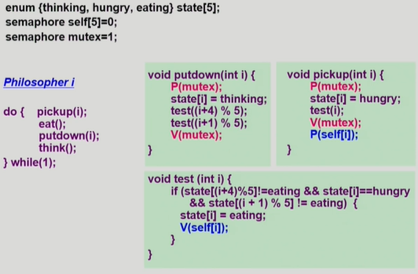

  - 짝수(홀수) 철학자는 왼쪽(오른쪽) 젓가락부터 집도록 한다


## Monitor

>동시 수행중인 프로세스 사이에서 추상 데이터 타입의 안전한 공유를 보장하기 위한 high-level synchronization construct

```
monitor monitor-name
{
	shared variable declarations
	procedure body P1(...) {
		...
	}
	procedure body P2(...) {
		...
	}
	procedure body Pn(...) {
		...
	}
	{
		initialization code
	}
}
```


#### Semaphore의 문제점

- 코딩하기 힘들다
- 정확성(correctness)의 입증이 어렵다
- 자발적 협력이 필요하다
- <u>한번의 실수가 모든 시스템에 치명적 영향</u>


#### Monitor

- 모니터 내에서는 한 번에 하나의 프로세스만이 활동 가능
- 프로그래머가 동기화 제약 조건(lock)을 명시적으로 코딩할 필요 없음
- 프로세스가 모니터 안에서 기다릴 수 있도록 하기 위해 <u>condition variable</u> 사용 `condition x, y;`
- **condition variable**은 wait과 signal 연산에 의해서만 접근 가능
  - `x.wait();` 
    - `x.wait()`을 invoke한 프로세스는 다른 프로세스가`x.signal()`을 invoke하기 전까지 suspend
  - `x.signal();`
    - `x.signal()`은 정확하게 하나의 suspend된 프로세스를 resume한다(깨워준다)
    - suspend된 프로세스가 없으면 아무 일도 일어나지 않는다


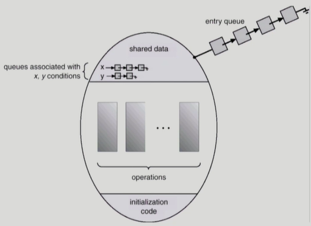

- Monitor안에 공유 데이터와 데이터를 접근하는 Procedure를 저장해놓고 Monitor를 통해서만 공유 데이터를 접근하도록 하는 것
- Monitor 내부의 Procedure들이 동시에 여러개가 실행되지 않도록 통제하는 권한을 가지며, Monitor에 대한 동시 접근이 허가되지 않음
- 프로그래머가 Lock을 걸 필요없이 Monitor를 통해 공유 데이터를 접근하면 됨


#### Bounded-Buffer Problem

```
monitor bounded_buffer
{
	int buffer[N];
	condition full, empty; 
	/* condition.var 은 값을 가지지 않고 자신의 큐에 프로세스를 매달아서 sleep 시키거나 큐에서 프로	세스를 깨우는 역할만 함*/
	
	void produce(int x)
	{
		if there is no empty buffer
			empty.wait();
		add x to an empty buffer
		full.signal();
	}
	
	void consume(int *x)
	{
		if there is no full buffer
			full.wait();
		remove an item from buffer and store it to *x
		empty.signal();
	}
}
```


#### Dining-Philosophers Problem

```
monitor dining_philosopher
{
	enum {thinking, hungry, eating} state[5];
	condition self[5];
	void pickup(int i) {
		state[i] = hungry;
		test(i);
		if (state[i] != eating)
			self[i].wait();
	}
	
	void putdown(int i) {
		state[i] = thinking;
		test((i+4) % 5);
		test((i+1) % 5);
	}
	
	void test(int i) {
		if (state[(i+4)%5]!=eating) && (state[i]==hungry) && (state[(i+1)%5]!=eating) {
			state[i] = eating;
			self[i].signal();
		}	
	}
	
	void init() {
		for (int i = 0; i < 5; i++)
			state[i] = thinking;
	}
}
```

```
Each Philosopher:
{
	pickup(i);
	eat();
	putdown(i);
	think();
}
```

