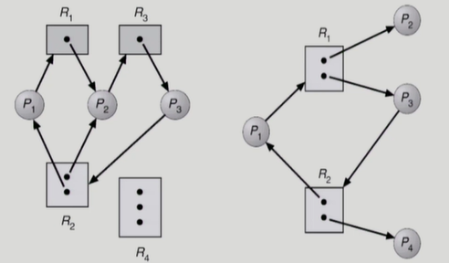
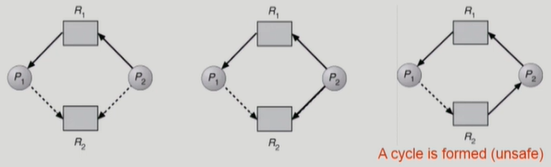
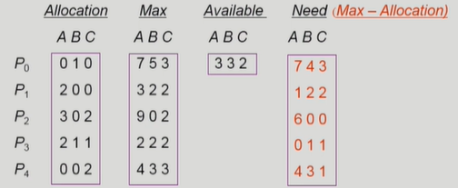
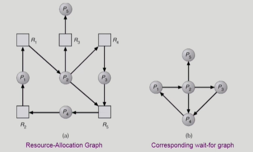
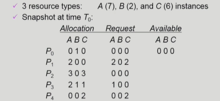

# Deadlock

> Deadlock problem, Deadlock 발생의 4가지 조건, Resource-Allocation graph, Deadlock의 4가지 처리 방법(Deadlock Prevention, Deadlock Avoidance, Deadlock detection and recovery, Deadlock Ignorance)

#### The Deadlock Problem

- <u>Deadlock</u>
  - 일련의 프로세스들이 서로가 가진 원을 기다리며 block된 상태
- <u>Resource</u>
  - 하드웨어, 소프트웨어 등을 포함하는 개념
  - I/O device, CPU cycle, memory space, semaphore 등
  - 프로세스가 자원을 사용하는 절차
    - Request, Allocate, Use, Release

#### Deadlock 발생의 4가지 조건

- <u>Mutual exclusion</u>
  - 매 순간 하나의 프로세스만이 자원을 사용할 수 있음
- <u>No preemption</u>
  - 프로세스는 자원을 스스로 내어놓을 뿐 강제로 빼앗기지 않음
- <u>Hold and wait</u>
  - 자원을 가진 프로세스가 다른 자원을 기다릴 때 보유 자원을 놓지 않고 계속 가지고 있음
- <u>Circular wait</u>
  - 자원을 기다리는 프로세스 간에 사이클이 형성되어야 함
  - P1의 자원은 P2가, P2의 자원은 P3가, ..., Pn-1의 자원은 Pn, Pn의 자원은 P1이 가지고 있음

#### Resource-Allocation Graph 

> 왼쪽 그림은 R2의 인스턴스가 2개이지만, 동시에 2개의 사이클이 만들어져 있어 <u>deadlock</u>
>
> 오른쪽 그림은 사이클이 형성되어 있지만, R1과 R2의 인스턴스가 2개씩 있고 P2혹은 P4가 자원을 사용하고 내어놓으면 사이클이 해소될 수 있으므로  deadlock이 아님

- Vertex
  - Process P = {P1, P2, ..., Pn}
  - Resource R = {R1, R2, ..., Rn}
- Edge
  - request edge Pi → Rj
  - assignment edge Rj → Pi

- 그래프에 cycle이 없으면 deadlock이 아니다
- 그래프에 cycle이 있으면
  - if <u>only one instance</u> per resource type, then <u>deadlock</u>
  - if several instances per resource type, possibility of deadlock

## Deadlock의 처리 방법

> 맨 위 가장 강력한 방법부터 맨 아래 방치하는 방법까지
>
> 현대의 OS는 Deadlock을 예방하는 것이 비효율적이기 때문에 Deadlock Ignorance를 채택

- <u>Deadlock Prevention</u> 
- <u>Deadlock Avoidance</u>
- <u>Deadlock Detection and recovery</u>
- <u>Deadlock Ignorance</u>

#### Deadlock Prevention

> 자원 할당 시 Deadlock 조건 4가지 중 어느 하나가 만족되지 않도록 함

- <u>Mutual exclusion</u>
  - 공유해서는 안되는 자원의 경우 반드시 성립해야 함
- <u>No preemption</u>
  - process가 어떤 자원을 기다려야 하는 경우 이미 보유한 자원이 선점됨
  - 모든 필요한 자원을 얻을 수 있을 때 그 프로세스는 다시 시작된다
  - State를 쉽게 save하고 restore할 수 있는 자원에서 주로 사용 (CPU, memory)
- <u>Hold and wait</u>
  - 프로세스가 자원을 요청할 때 다른 어떤 자원도 가지고 있지 않아야 한다
  - 방법 1: 프로세스 시작 시 모든 필요한 자원을 할당받게 하는 방법
  - 방법 2: 자원이 필요한 경우 보유 자원을 모두 놓고 다시 요청
- <u>Circular wait</u>
  - 모든 자원 유형에 할당 순서를 정하여 정해진 순서대로만 자원 할당

:arrow_right: utilization 저하, throughput 감소, starvation 문제

#### Deadlock Avoidance

> 자원 요청에 대한 부가적인 정보를 이용해서 deadlock의 가능성이 없는 경우에만 자원을 할당

- safe state

  - 시스템 내의 프로세스들에 대한 safe sequence가 존재하는 상태

- safe sequence

  - 프로세스의 sequence<P1, P2, ..., Pn>이 safe 하려면 Pi의 자원 요청이 '가용자원 + Pi 이전의 모든 프로세스의 보유자원' 보다 작아야 한다

-  Deadlock Avoidance

  - 시스템이 unsafe state에 들어가지 않는 것을 보장
  - 2가지 경우의 avoidance 알고리즘
    - Single instance per resource types
      - <u>Resource Allocation Graph algorithm 사용</u>
    - Multiple instances per resource types
      - <u>Banker's Algorithm 사용</u>

- **Resource Allocation Graph algorithm**

  

  > 3번째 그림은 P1이 R2를 요청하면 deadlock이 발생하는 상황
  >
  > 점선을 포함한 사이클이 발생하는 경우 unsafe한 상황으로 간주

  - <u>Claim edge</u> Pi → Rj
    - 프로세스 Pi가 자원 Rj를 미래에 요청할 수 있음을 뜻함 (점선으로 표시)
    - 프로세스가 해당 자원 요청 시 request edge로 바뀜 (실선)
    - Rj가 release 되면 assignment edge는 다시 claim edge로 바뀜
  - 점선을 포함하여 cycle이 생기지 않는 경우에만 요청 자원을 할당한다

- **Banker's Algorithm**

  

  - 각 프로세스가 필요로 하는 자원이 가용 자원의 수보다 많은 경우 최악의 경우 가용 자원보다 더 많은 자원을 요구할 수 있으므로 unsafe하다고 판단
  - 위의 예에서 P1, P3에게는 할당, P0, P2, P4에게는 할당하지 않음
  - sequence <P1, P3, P4, P2, P0>가 존재하므로 시스템은 safe state
  - 보수적인 판단, 비효율적인 알고리즘

#### Deadlock Detection and Recovery

> Deadlock 발생은 허용하되 그에 대한 detection 루틴을 두어 deadlock 발생 시 recover

- Deadlock Detection

  - Resource type 당 single instance인 경우

    

    - 자원할당 그래프(wait-for-graph)에서의 cycle이 곧 deadlock을 의미
    - DFS를 이용해 O(n^2)의 시간 복잡도로 cycle 여부 확인 가능

  - Resource type 당 multiple instance인 경우

    

    - sequence <P0, P2, P3, P1, P4>가 가능
    - 가능한 sequence가 없다면 deadlock
    - Request는 추가 요청 가능한 양이 아니라 실제로 현재 요청한 양임

- Recovery
  - <u>Process termination</u>
    - deadlock에 연루된 프로세스를 모두 종료시킴
    - deadlock이 사라질 때까지 하나씩 종료시킴
  - <u>Resource Preemption</u>
    - 비용을 최소화 할 victim 선정
    - safe state로 rollback하여 process를 restart
    - starvation 문제
      - 동일한 프로세스가 계속해서 victim으로 선정되는 경우
      - cost factor에 rollback 횟수도 같이 고려

#### Deadlock Ignorance

- Deadlock이 일어나지 않는다고 생각하고 아무런 조치도 취하지 않음
  - Deadlock 상황이 드물기 때문에 이를 처리하는 것이 더 비효율적
  - 사용자가 이상을 감지하고 프로세스를 종료해야 함